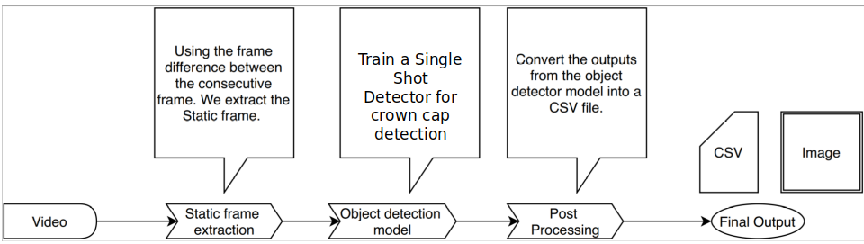
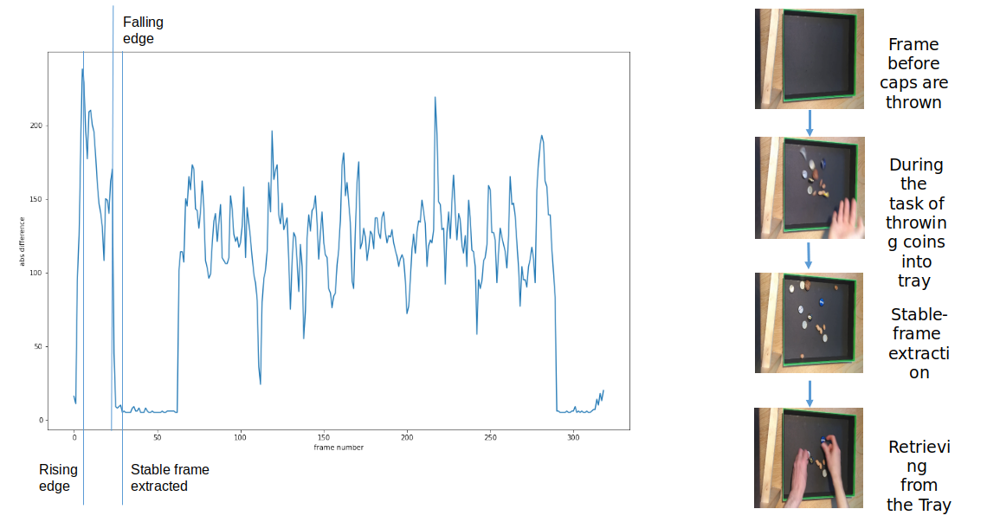
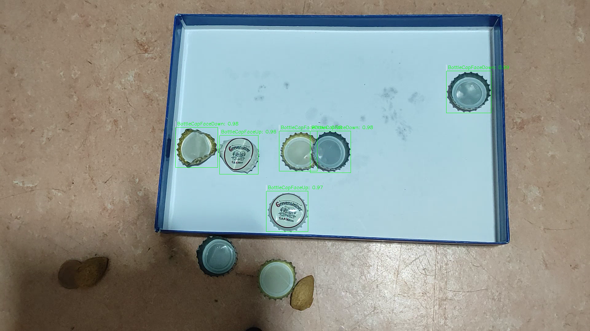
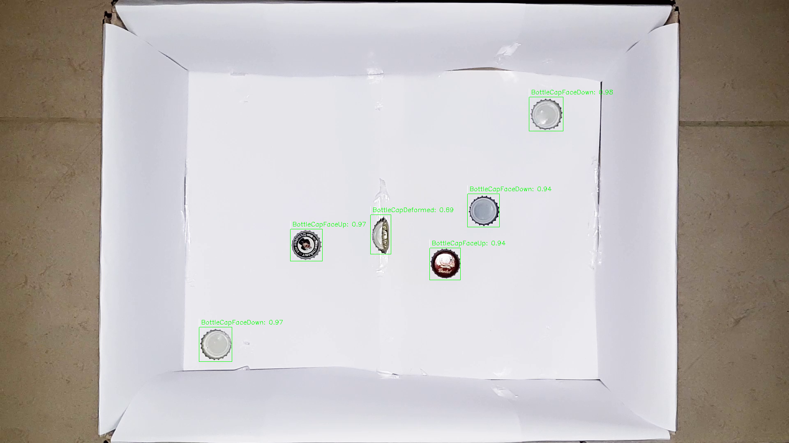
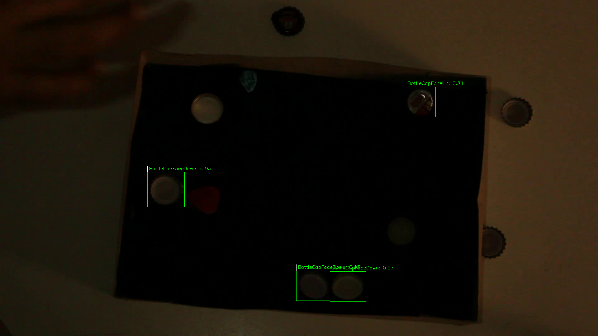
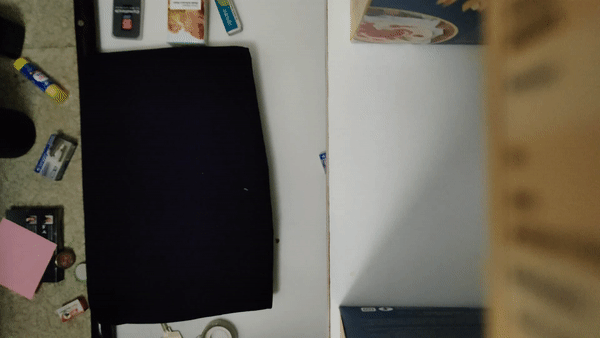

# BCDC-Net
A Project for Computer Vision Course. 

This work concentrates on building a pipeline for solving a task of detecting the crown caps in a tray from a video stream. The following steps are followed to solve the task 

1. Extracting a stable frame from the video stream

2. Detecting the objects of interest in the stable frame

3. Post-detection processing.

Since, the requirements of the competition stipulated the detections to be confined to the Tray. We also detect the Tray in the image

Filter the cap detections by removing the caps detections outside of the bounding box of the Tray  

## Sample input

## Pipeline

## Tools used
* Tensorflow: 2.4.1
* Tensorflow Object Detection api
* OpenCV: 4.4.0
* numpy: 1.19.2
* labelMe

## Steps of execution

1) Edit **ubuntu_run.sh** inside the BCDC-Net folder

2) Download the model from [here](https://drive.google.com/file/d/1t2Y3m5vJ05xOTdpPQumOXXxvQmJJqsRI/view?usp=sharing)

3) Extract the model to **models/tf2_model/**

    The **tf2_model/** folder contains 1. checkpoint (folder)  2. pipeline.config (config file) 3. saved_model (folder)

3) The command should be as follows 

    > python src/cap_detector.py --video_path PATH_TO_VIDEOS --result_path PATH_TO_RESULTS_FOLDER

    Replace **PATH_TO_VIDEOS** with the path in which the test videos are present in double quotes("").

    Replace **PATH_TO_RESULTS_FOLDER** with the path in which the result csv files are to be stored in double quotes("").

## Results

### Stable-frame Extraction

we used absolute difference from previous frame to the current frame and a falling edge in its value is
used as a trigger for capturing stable frame. The results for a sample video is as follows

To perform crown caps detection we used a Single Shot Detector model and trained it on a dataset that’s custom annotated.

### Cap-detection

### Detection in general lighting conditions

we can observe that the detections are just confined to the Tray in the image.

 

### Detection in case of improper infrastructure present

In the above picture, even though a tray is not used but a tray like object is used. The model is still able to detect a tray like object and the detections are made as usual. 

### Detection in case of improper lighting

The model perfrmed decent enough in case of very poor lighting. Also, the Tray is also detected correctly.

## Fallbacks

1. In case of a bad video input with continuous changes. The stable frame extraction is failing. In this case we used middle frame of the video as a stable frame.

2. The SSD model is not able to detect the Tray. In such cases we used a largest rectangle extraction by using classical computer vision techniques.

